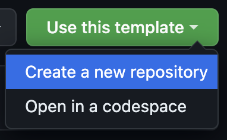

# OOP - 2023/24 - Assignment 2

This is the base repository for assignment 2.
Please follow the instructions given in the [PDF](https://brightspace.rug.nl/content/enforced/243046-WBAI045-05.2023-2024.1/assignment%202_v1.1.pdf) for the content of the exercise.

## How to carry out your assignment

**PLEASE FOLLOW THESE STEPS:**

1. Use this template and create a private repository:
   
2. Please add your partner and `oop-otoz` to the collaborators.
3. Create a new branch called `submission` **before adding any files**.
4. Add your code in the `main` branch (**IF YOU DO NOT ADD ANYTHING, THE PULL REQUEST WILL NOT WORK**).
5. Make sure that Actions are allowed: Settings -> Actions -> General -> Allow all actions and workflows.
6. Create a pull request from the `main` branch to your `submission` branch and check that your changes are captured.
7. Now finish your solution.
8. When you are ready to submit, add `oop-otoz` to the reviewers.

**Notes:**

- **Leave the \*\***init\***\*.py files untouched**.
- Do not move the `main.py` files.
- Do not move `requirements.txt`.
- Make the pull request AFTER SUBMITTING SOME CHANGES.

Below this line, you can write your report to motivate your design choices.

## Submission

The code should be submitted on GitHub by opening a Pull Request from the `main` branch on to the `submission` branch. This means that `submission` is the base branch and `main` the compare branch. **Make sure to push your code only to `main`!**

There are automated checks that verify that your submission is correct:

1. Deadline - checks that the last commit in a PR was made before the deadline.
2. Reproducibility - downloads libraries included in `requirements.txt` and runs `python3 main.py`. If your code does not throw any errors, it will be marked as reproducible. **Make sure it is reproducible before submission!**
3. Style - runs `flake8` on your code to ensure adherence to style guides.
4. Tests - runs `unittest` on your tests in `part_1/tests` to make sure all tests succeed.

---

## Your report
Mekhola Doha S4790650 number
Eman Ansari S4317394
Group 74
Assignment 2 Report 
part i

For Mastermind.py, we divide the game responsibilities in 3 classes, the CodeMaker class, the CodeBreaker class, and the Game class. All methods and attributes are public for simplicity in a small game like this and the game design emphasizes encapsulation. With the following outline of game structure, we tested the functionality of each method according to TDD principles. 

CodeMaker is responsible for:
Generating a random list of 4 alphabets out of the valid letters ‘WRGYBX’ (X stands for black) using the generate_code method
A method provide_feedback would evaluate the user input against the code generated and returns feedback on number of colors in correct/incorrect positions
__init__(self) constructor defines the list of valid letters and the generated code as public attributes of this class.

CodeBreaker is responsible for: 
Managing a list of guesses made by the user as a public attribute
 make_guess method prompts the user to input a four-character guess composed of valid colors ("WRGYBX"). It checks if the input is valid and returns the guess.

Game is responsible for the game logic:
initializing CodeMaker and CodeBreaker
setting a maximum number of attempts.
The play_round method initializes the rounds, displaying feedback every iteration. 
The play method runs rounds until success or the attempt limit, providing game outcomes.

part ii

2.1 and 2.2
For this part of the assignment we decided to use Marco's solutions to assignment 1 to implement the further developments.
Both the classes, MultiLinearRegression and ModelSaver now inherit from the abstract MLModel that was asked to create. TypeError is raised if this input requirement is not met. 

2.3
The classes LassoRegression and RidgeRegression inherit from the class MultipleLinearRegression. Using the MultipleLinearRegression as base class we then override the train methods. Based on the equations given (5 and 7) in the assignment gradient descent is calculated for each class. Both of them follow a similar structure to override the _initialize_parameters and train methods, and then they adapt them to their specific for methods. The train method performs iterative gradient descent, where in each iteration it will calculaet the predictions,  the loss and mean absolute error. This information is then logged and updated with the parameters that is computed using gradient descent. 

The solutions from assignment 1 (the ModelSaver and RegressionPlotter classes were edited to work for the implementation) 

++For main.py we weren’t sure how to structure it since there weren't any instructions on the assignment. When you run it it will ask for arguments and then it will run the model. At the end, we were having some issues with this but it worked on one of our local repositories. 

